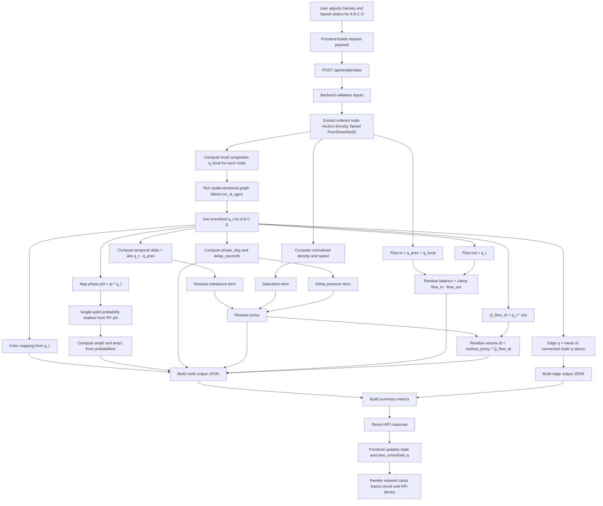
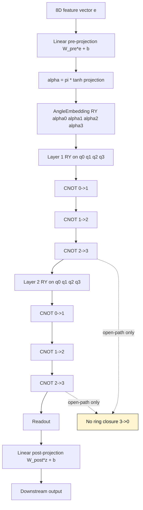
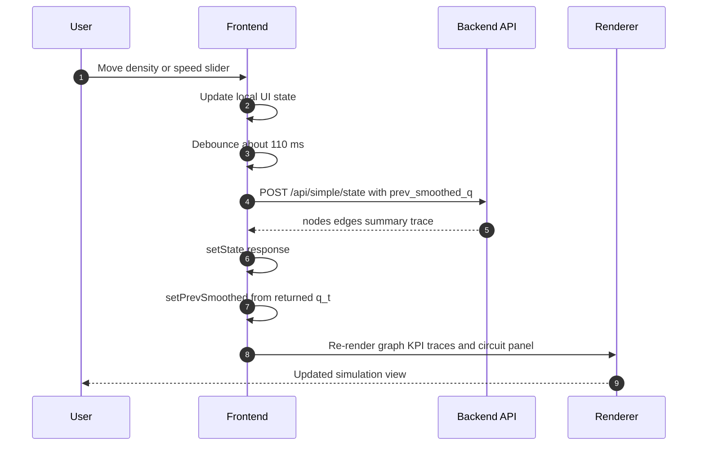

# Capstone Basic Flowcharts

This document contains detailed Mermaid flowcharts for the current implementation, including a master connected overview.

## How to Read This

Use this map to connect each flowchart to the exact implementation location.

- Chart 1 (End-to-End Simple Network Simulation): request/response lifecycle from frontend controls to backend output.
    - Frontend trigger and state updates: `frontend/src/pages/SimpleNetworkPage.jsx` (`useEffect`, payload builder, `setPrevSmoothed`)
    - API handler: `backend/main.py` (`simple_state`)
- Chart 2 (Per-Node Mathematical Pipeline): per-node numeric formulas used during each backend update step.
    - Local signal and normalization: `backend/main.py` (`traffic_signal`)
    - Graph + temporal blend: `backend/main.py` (`run_st_qgcn`)
    - Phase, delay, residue, conservation, dt metrics: `backend/main.py` (`simple_state` loop)
- Chart 3 (Quantum Part Used in Live Readout): single-qubit display path currently used for per-node amplitude cards.
    - Qubit probability node: `backend/main.py` (`qubit_probs`)
    - UI render of amplitudes: `frontend/src/pages/SimpleNetworkPage.jsx` (readout list)
- Chart 4 (Open-Path 4-Qubit Architecture Reference): architecture module present in codebase for 4-qubit open-path design.
    - Model class and circuit: `backend/main.py` (`TrafficQuantumLayer`)
    - Open-path circuit text rendering utility: `backend/main.py` (`build_open_path_circuit_text`)
- Chart 5 (Frontend Reactive Update Loop): interaction timing and render loop behavior.
    - Debounce and API call timing: `frontend/src/pages/SimpleNetworkPage.jsx`
    - Endpoint integration: `frontend/src/api.js`
- Chart 6 (Master Connected Flowchart): complete stack view combining active simulation path and architecture context.
    - Runtime endpoint + metrics: `backend/main.py` (`simple_state`)
    - Presentation layer: `frontend/src/pages/SimpleNetworkPage.jsx`

Quick interpretation order for presentations:

1. Start with Chart 1 to explain the big picture.
2. Move to Chart 2 for exact equations and metrics.
3. Use Chart 3 for the current live quantum readout shown in UI.
4. Use Chart 4 to explain the 4-qubit open-path architecture reference.
5. Close with Chart 6 to reconnect all pieces into one story.

## 1) End-to-End Simple Network Simulation



## 2) Per-Node Mathematical Pipeline

```mermaid
flowchart TD
    A[Inputs for one node density speed q_prev neighbor q_local] --> B[Normalize density and speed]
    B --> C[q_local = 0.7*d_norm + 0.3*(1 - s_norm)]

    C --> D[graph_mix = 0.55*self_q_local + 0.45*neighbor_avg]
    D --> E[q_t = 0.65*q_prev + 0.35*graph_mix]
    E --> F[Clamp q_t to 0..1]

    F --> G[phi = pi * q_t]
    G --> H[phase_deg = min phi*180/pi and 90]
    H --> I[delay_seconds = phase_deg * (0.30 + 0.70*q_t)]

    F --> J[temporal_delta = abs q_t - q_prev]
    B --> K[saturation_core = d_norm^1.15 * (1 - s_norm)]
    I --> L[delay_pressure = min delay_seconds/60 and 1]

    J --> M[imbalance_term = 0.45*temporal_delta]
    K --> N[saturation_term = 0.35*saturation_core]
    L --> O[delay_term = 0.20*delay_pressure]

    M --> P[residue_proxy = clamp imbalance + saturation + delay]
    N --> P
    O --> P

    QP[q_prev] --> Q[flow_in = q_prev + q_local]
    C --> Q
    F --> R[flow_out = q_t]
    Q --> S[residue_balance = clamp max 0 of flow_in - flow_out]
    R --> S

    F --> T[Q_flow_dt = q_t * 15]
    P --> U[residue_volume_dt = residue_proxy * Q_flow_dt]
    T --> U

    G --> V[Quantum display values]
    V --> W[amp0 approx cos phi/2 and amp1 approx sin phi/2]
```

## 3) Quantum Part Used in Live Readout

```mermaid
flowchart LR
    A[Smoothed congestion q_t in 0..1] --> B[phi = pi * q_t]
    B --> C[Apply single-qubit RY phi on |0>]
    C --> D[Measure probabilities p0 and p1]
    D --> E[amp0 = sqrt p0]
    D --> F[amp1 = sqrt p1]
    E --> G[UI line for |0> amplitude]
    F --> H[UI line for |1> amplitude]
```

## 4) Open-Path 4-Qubit Architecture Reference in Codebase



## 5) Frontend Reactive Update Loop



## 6) Master Connected Flowchart

```mermaid
flowchart TB
    subgraph UI[Frontend Interaction Layer]
        U1[Density and Speed Sliders A B C D]
        U2[Payload Builder]
        U3[Debounced Request Trigger]
        U4[Render Network Metrics Trace Circuit]
    end

    subgraph API[Backend Endpoint Layer]
        B1[POST /api/simple/state]
        B2[Input Validation and Node Ordering]
    end

    subgraph CORE[Traffic Dynamics Core]
        C1[Normalize density and speed]
        C2[q_local = 0.7*d_norm + 0.3*(1-s_norm)]
        C3[Graph mix: self 0.55 neighbor 0.45]
        C4[Temporal blend: q_t = 0.65*q_prev + 0.35*graph_mix]
        C5[Clamp q_t to 0..1]
    end

    subgraph OPS[Operational Metrics]
        O1[phi = pi*q_t]
        O2[phase_deg clipped to 90]
        O3[delay_seconds]
        O4[temporal_delta]
        O5[saturation term]
        O6[delay pressure term]
        O7[residue_proxy]
        O8[flow_in flow_out residue_balance]
        O9[Q_flow_dt and residue_volume_dt]
    end

    subgraph QUANTUM[Quantum Readout Used Live]
        Q1[Single qubit RY phi]
        Q2[Probabilities p0 p1]
        Q3[Amplitudes amp0 amp1]
    end

    subgraph TOPO[Reference 4-Qubit Open-Path Architecture]
        T1[8D input embedding]
        T2[alpha = pi*tanh pre-projection]
        T3[AngleEmbedding RY on 4 qubits]
        T4[CNOT 0->1->2->3 open path]
        T5[Z expectation readout and post-projection]
    end

    subgraph OUT[Response Assembly]
        R1[Per-node JSON with trace lines]
        R2[Edge JSON from adjacent means]
        R3[Summary metrics]
        R4[Return response]
    end

    U1 --> U2 --> U3 --> B1 --> B2
    B2 --> C1 --> C2 --> C3 --> C4 --> C5

    C5 --> O1 --> O2 --> O3
    C5 --> O4
    C1 --> O5
    O3 --> O6
    O4 --> O7
    O5 --> O7
    O6 --> O7
    C2 --> O8
    C5 --> O8
    C5 --> O9
    O7 --> O9

    C5 --> Q1 --> Q2 --> Q3

    T1 --> T2 --> T3 --> T4 --> T5
    T4 -. No 3->0 ring edge .- T5

    O2 --> R1
    O3 --> R1
    O7 --> R1
    O8 --> R1
    O9 --> R1
    Q3 --> R1

    C5 --> R2
    R1 --> R3
    R2 --> R3
    R3 --> R4 --> U4
```

---

Notes:
- The live simple simulation uses open-path concepts and per-node single-qubit readout for display metrics.
- The master chart includes both the active simulation path and the reference 4-qubit open-path architecture so the full design context is visible.

## 7) Slide-Ready Overall Diagram (16:9 Horizontal)

Use this compact version when you need one readable diagram on a single presentation slide.

```mermaid
%%{init: {"theme": "default", "flowchart": {"curve": "linear", "nodeSpacing": 24, "rankSpacing": 36}, "themeVariables": {"fontSize": "13px"}}}%%
flowchart LR
    U[UI Controls<br/>density d, speed v] --> P[Payload<br/>q(t−1) memory]
    P --> A[POST /api/simple/state]

    A --> N[Normalize<br/>d̂, ŝ]
    N --> L[q_local = 0.7d̂ + 0.3(1−ŝ)]
    L --> G[g = 0.55q_local + 0.45q̄_nbr]
    G --> T[q(t) = 0.65q(t−1) + 0.35g]

    T --> PH[φ = πq(t)]
    PH --> DLY[τ = φ°(0.30 + 0.70q)]
    T --> RES[r = 0.45|Δq| + 0.35s + 0.20p_d]
    T --> BAL[b = max(0, f_in − f_out)]
    T --> DT[Q(Δt) = qΔt<br/>V_r = rQ(Δt)]

    PH --> Q1[RY(φ)|0⟩]
    Q1 --> AMP[a₀ = √p₀, a₁ = √p₁]

    T --> EDGE[q_e = mean(q_i, q_j)]
    DLY --> OUT[Node metrics + trace]
    RES --> OUT
    BAL --> OUT
    DT --> OUT
    AMP --> OUT
    EDGE --> SUM[Summary Σ]
    OUT --> SUM

    SUM --> R[Frontend Render<br/>Cards Graph Circuit]

    subgraph REF[Reference Quantum Architecture in Codebase]
        R1[h ∈ ℝ⁸]
        R2[α = π tanh(W_in h + b)]
        R3[⊗ RY(α_i)]
        R4[CNOT 0→1→2→3]
        R5[⟨Z⟩ → W_out z + b]
        R1 --> R2 --> R3 --> R4 --> R5
        X[No 3→0 ring edge]
        R4 -.-> X
    end
```

Presentation tip:

1. Place this diagram alone on one slide.
2. Use build animation by columns: UI/API → Core → Metrics → Output.
3. Mention REF block last as architecture context, not main live path.
